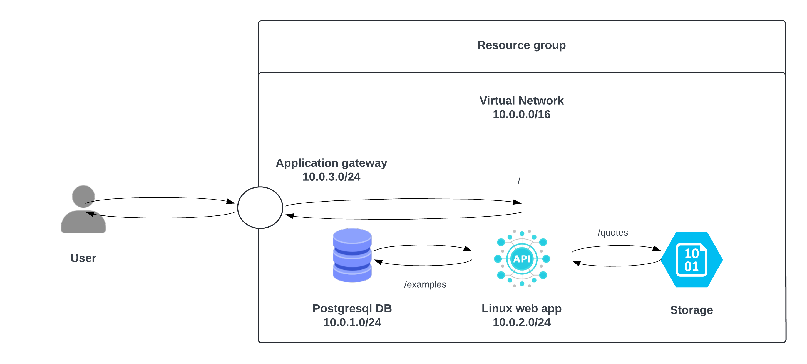

# Projet : Cloud computing 
API written by Fabien HUITELEC and declarative code of infrastructure (Microsoft Azure) using HCL Terraform.

## Project Description
This project involves provisioning a cloud infrastructure on Microsoft Azure and deploying a Python-based API using the FastAPI framework. Additionally, it includes a CI/CD pipeline configured with GitHub Actions for automated testing, building, and deployment.

## Working group
The whole project has been developped by four contributors :
- Louis SKRZYPCZAK (Software engineer, DevOps @Bopizy)
- Arthur LAFONT (Cybersecurity consultant @Cintamaya)
- Mélodie COCHET (Cybersecurity consultant @Orange_Cyberdefense)
- Alexandra RENOUVIN--DELECOURT (Cybersecurity student @Junia_ISEN)

Feel free to explore this repository and reach out with any questions. If you wish to use any part of our code (CI/CD workflows or Terraform modules), please ensure to mention us appropriately.

## Technologies used

- Terraform by HashiCorp `v1.5.7`
- Python `>=v3.12`
- FastAPI `>=v0.115.0`

## Project structure

The repository is organized into the following directories :
- `.github` : contains the CI/CD declaration
- `examples ` : contains the API written in Python using FastAPI framework
- `infrastructure` : contains the cloud architecture declarations
- `test` : contains as the name suggest, unit test for API endpoints 

## Installation

### Requirements

- HashiCorp Terraform `v1.5.7+` : https://developer.hashicorp.com/terraform/tutorials/aws-get-started/install-cli
- A working brain
- Azure CLI `v2.66+` :
https://learn.microsoft.com/fr-fr/cli/azure/install-azure-cli

### Directives to run the project
- Clone this repository on your machine using https or ssh protocol depends on your configuration
- Open this in your favorite text editor or IDE
- In `./infrastructure` folder, you'll find `terraform.tfvars.sample` file. You have to copy/paste it and delete the `.sample` extension. Then you should add your Microsoft Azure subscription ID, create a login and a password for the postgresql flexible server administrator. Make sure the password is strong and meet the right requirements
- Still in `./infrastructure` folder, run in this order `terraform init`, `terraform plan` and finally `terraform apply` to provision the cloud infrastructure 

## Motivation and architecture
The aim of this project is to put into practice the concepts seen during the few weeks of the @Junia_ISEN cloud computing course. To do this, we need to design an architecture and provision the infrastructure on Microsoft Azure. To do this, a simplistic API will be deployed, along with a postgresql database and file storage. 
To find out more about the technical constraints and the project requirements, please follow this link: https://malachite-typhoon-29c.notion.site/Cloud-Computing-nonc-projet-11e0466cf1e080c9b271da46c5c20723

The architecture of our proposition could be resumed in an image, which follows :

